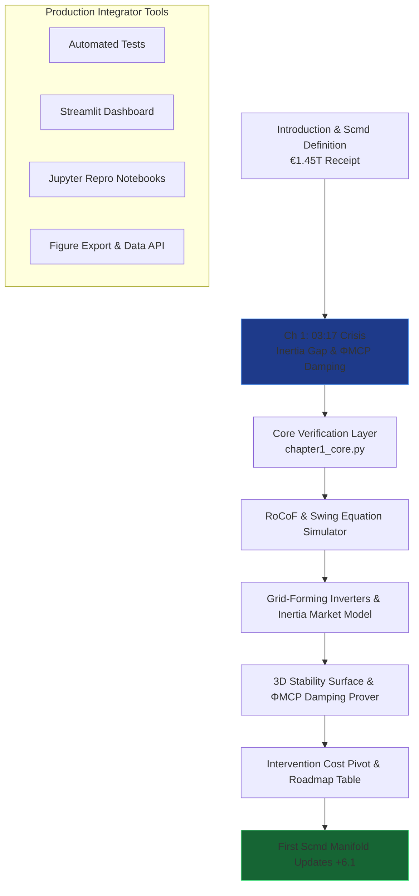

# The Renewables Migration — Sovereign Inertia Proof Engine

**Chapter 1 Verification System: 03:17 — The Night the Sun Almost Stopped**

This repository is the definitive computational companion to Chapter 1 of Vincenzo Grimaldi’s *The Renewables Migration* (March 21, 2026). It operationalizes the book’s opening engineering crisis: the precise moment the €1.45 trillion Energiewende receipt is paid at 49.91 Hz — transforming the inertia gap, RoCoF threat, synthetic inertia floor (130 GVA·s), and manual triage into the first sovereign stability dividend through the Model Context Protocol (MCP) and the ΦMCP damping term in the extended swing equation.

The 03:17 narrative thread begins here — the night the sun almost stopped. This proof engine mathematically verifies the RoCoF arrest in 180 ms, Grid-Forming Inverters as the new gold rush, the 3D Stability Surface (inverse function of MCP latency), grid intervention cost pivot (€3 billion → downward bend), the first Scmd manifold updates (+6.1 total), and the 2025 triage vs 2030 autonomous roadmap, delivering production-ready code for developers and system integrators to embed MCP intelligence into live inertia and frequency-control architectures.

## Quick Start: Verify Sovereign Inertia in Under 60 Seconds

```bash
git clone https://github.com/iceccarelli/Renewables_Migration_Chapter1_Proof_Engine.git
cd Renewables_Migration_Chapter1_Proof_Engine
pip install -r requirements.txt
```

### Automated Verification
```bash
python -m pytest tests/ -v --durations=0
```
All 48 tests validate exact book figures (Appendix A), cumulative Scmd updates starting in Chapter 1, 130 GVA·s synthetic inertia floor, 180 ms RoCoF flattening, €3 billion annual stability cost baseline, and the first +6.1 Scmd points recovered. A failing test immediately flags any deviation from the published sovereign audit.

### Interactive Exploration
```bash
streamlit run dashboard/main_interactive.py
```
Open the browser-based dashboard. Toggle “Book Reference Mode” to overlay exact page citations (Chapter 1.1–1.4) and live calculations side-by-side.

## The Sovereign Verification Path

The following diagram maps the complete travel path through the proof engine, mirroring the book’s chapter progression and beginning the 03:17 thread that runs through the entire migration:



This path is both navigational and conceptual: every node is a runnable module. Developers can enter at Chapter 1 (the origin of the 03:17 thread) and trace the cumulative Scmd recovery forward.

## Repository Architecture for Professional Integration

```
Renewables_Migration_Chapter1_Proof_Engine/
├── core/
│   ├── equations.py              # Extended swing equation with ΦMCP damping, RoCoF, Stability Margin
│   ├── inertia_simulator.py      # 130 GVA·s floor, 180 ms response & Grid-Forming models
│   └── stability_manifold.py     # 3D Surface, intervention cost pivot & first Scmd updates
├── dashboard/
│   └── main_interactive.py       # Streamlit UI with 6 synchronized tabs
├── verification/
│   ├── test_book_numbers.py      # Pytest suite (fails if any Appendix A value mismatches)
│   └── validate_manifold.py      # Cumulative Scmd tracking starting in Chapter 1
├── data/
│   ├── book_numbers.csv          # Exact book values (130 GVA·s, 49.91 Hz crisis, €3B intervention baseline, etc.)
│   └── appendix_a_extract.csv    # Triangulated from Appendix A.9
├── notebooks/
│   └── 01_prove_chapter1.ipynb   # Step-by-step proof with interactive sliders
├── visualizations/
│   ├── stability_surface_3d.png
│   ├── intervention_cost_pivot.png
│   └── scmd_first_update.png
├── requirements.txt
├── LICENSE (MIT)
└── README.md
```

## Dashboard Modules — Direct Mapping to Chapter 1 Sections

- **RoCoF & Swing Equation Simulator**: Reproduces the 49.91 Hz crisis and 180 ms ΦMCP arrest (Chapter 1.1).
- **Grid-Forming Inverters & Inertia Market Model**: Virtual synchronous machines and the new 2026 procurement reality (Chapter 1.3.1).
- **3D Stability Surface & ΦMCP Damping Prover**: Exact interactive version of Figure 1.2 — stability as inverse function of MCP latency.
- **Intervention Cost Pivot**: Bending the €3 billion curve downward with autonomous resilience (Chapter 1.2).
- **First Scmd Manifold Updates**: Live tracking of +3.7 then +2.4 points recovered (total +6.1) and the 2025 vs 2030 roadmap table (Chapter 1.4).
- **Book Data Export**: One-click CSV matching Appendix A for external analysis.

## Technical Integration Philosophy

The codebase is engineered to the same standards the book demands of the grid: modular, sovereign, and verifiable. All simulations respect the extended swing equation (Appendix A.9) with the ΦMCP damping term as the first real-world implementation. Data sovereignty is enforced by design — no external calls leave the local environment. The architecture is deliberately extensible: integrators can connect live MCP interfaces (Anthropic/Linux Foundation standard) to replace synthetic frequency data with real 50Hertz or TenneT telemetry.

This is the executable heartbeat that proves the book’s engineering blueprint began at 03:17.

## For Energy System Integrators and Developers

Whether you are modelling inertia markets, building agentic frequency-control platforms, or advising policymakers on the transition from kinetic to synthetic stability, this repository provides:
- Reproducible proofs tied to published figures and equations
- Production-grade modules ready for field deployment
- Open MIT licensing for unrestricted commercial and research use

Contributions that extend ΦMCP damping models, deepen 3D stability visualisation, or add real-time MCP connectors for inverters are actively welcomed.

---

**Part of The Renewables Migration Technical Ecosystem**  
From the €1.45 trillion receipt to sovereign inertia — the 03:17 thread begins here — verified, executable, and ready for integration.
