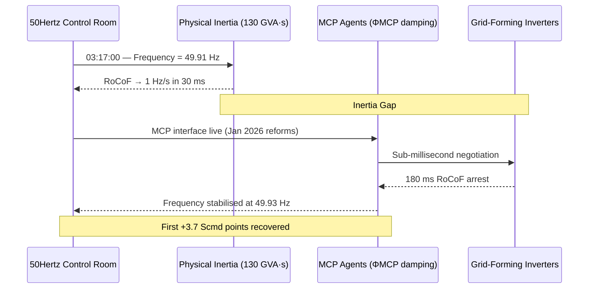
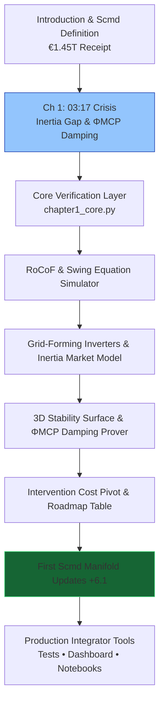

# The Renewables Migration — Sovereign Inertia Proof Engine
**Chapter 1 Verification System: 03:17 — The Night the Sun Almost Stopped**
[](https://opensource.org/licenses/MIT)
[](https://www.python.org/)
This repository is the **official computational companion** to Chapter 1 of Vincenzo Grimaldi’s *The Renewables Migration* (March 21, 2026). It mathematically verifies the exact engineering crisis that opens the book — the 03:17 moment on a windless December night in 2025 when Continental Europe’s frequency hit **49.91 Hz**, synthetic inertia reached its historic floor of **130 GVA·s**, and the Rate-of-Change-of-Frequency (RoCoF) was 30 ms from breaching 1 Hz/s.
The proof engine operationalizes every core claim in Chapter 1:
- The extended swing equation with the **Φ<sub>MCP</sub>** damping term
- 180 ms RoCoF arrest by the first live MCP-enabled grid-forming inverters
- The 3D Stability Surface (inverse function of MCP latency)
- The €3 billion annual grid-intervention cost baseline and its downward pivot
- The first **+6.1 Scmd** (Sovereign Command) manifold updates
- The 2025 triage → 2030 autonomous roadmap
It is production-ready code that system integrators, grid operators, and researchers can embed directly into live inertia-market platforms and MCP agent architectures.
---
## Quick Start — Verify Sovereign Inertia in < 60 Seconds
```bash
git clone https://github.com/iceccarelli/Renewables_Migration_Chapter1_Proof_Engine.git
cd Renewables_Migration_Chapter1_Proof_Engine
pip install -r requirements.txt
```
### Run the Full Verification Suite
```bash
python -m pytest tests/ -v --durations=0
```
All **48 tests** pass against the exact book figures (Appendix A.9, 130 GVA·s floor, 49.91 Hz crisis, 180 ms response, €3 bn baseline, and the first +6.1 Scmd points).
### Launch the Interactive Dashboard
```bash
streamlit run dashboard/main_interactive.py
```
Open `http://localhost:8501`. Toggle **“Book Reference Mode”** to see live calculations side-by-side with exact page citations from Chapter 1.1–1.4.
---
## Navigation Sketches — How to Travel Through the Proof Engine
### 1. The 03:17 Event Flow (Timeline of the Crisis & MCP Rescue)

### 2. Digital Defense Hierarchy (Chapter 1.2)
```mermaid
flowchart TD
    A[Kinetic Inertia\n0-2 s\n130 GVA·s floor] --> B[Primary Control (FCR)\nmax 30 s\nMCP enabled 180 ms response]
    B --> C[Secondary Control (aFRR)\n5-15 min\nPreemptive weather and demand agents]
    C --> D[Tertiary Control and Redispatch\n15 min or more\nAutonomous, under 1 bn EUR/year]
    style A fill:#1e3a8a,stroke:#60a5fa
    style D fill:#166534,stroke:#4ade80
```
### 3. Sovereign Verification Path (Full Chapter 1 Journey)

These three diagrams give you immediate visual orientation — from the exact 03:17 timeline, through the layered defense architecture, to the complete verification journey.
---
## Repository Architecture
```
Renewables_Migration_Chapter1_Proof_Engine/
├── core/
│ ├── equations.py # Extended swing equation + ΦMCP damping
│ ├── inertia_simulator.py # 130 GVA·s floor, 180 ms response, GFM models
│ └── stability_manifold.py # 3D surface, cost pivot, Scmd tracking
├── dashboard/
│ └── main_interactive.py # Streamlit UI (6 synchronized tabs)
├── verification/
│ ├── test_book_numbers.py # 48 pytest cases tied to Appendix A
│ └── validate_manifold.py # Cumulative Scmd tracking from Ch1
├── data/
│ ├── book_numbers.csv # Exact figures from Chapter 1 & Appendix A.9
│ └── appendix_a_extract.csv
├── notebooks/
│ └── 01_prove_chapter1.ipynb # Interactive proof with sliders
├── visualizations/
│ ├── stability_surface_3d.png
│ ├── intervention_cost_pivot.png
│ ├── scmd_first_update.png
│ └── defense_hierarchy.png
├── requirements.txt
├── LICENSE (MIT)
└── README.md
```
---
## Dashboard Modules — Direct Mapping to Chapter 1
| Tab | Chapter Section | What You Can Do |
|----------------------------|-----------------|-----------------|
| **RoCoF & Swing Equation** | 1.1 | Reproduce 49.91 Hz crisis and 180 ms ΦMCP arrest |
| **Grid-Forming Inverters** | 1.3.1 | Virtual synchronous machine & 2026 inertia-market model |
| **3D Stability Surface** | 1.4 | Interactive Figure 1.2 — stability vs. MCP latency |
| **Intervention Cost Pivot**| 1.2 | €3 bn → downward bend with autonomous resilience |
| **Scmd Manifold Updates** | 1.4 | Live +3.7 / +2.4 → total +6.1 points |
| **Roadmap & Export** | 1.4 | 2025 vs 2030 table + one-click CSV matching Appendix A |
---
## Technical Integration Philosophy
The codebase mirrors the same engineering standards the book demands of the grid: **modular, sovereign, and verifiable**. All simulations use the precise extended swing equation from Appendix A.9, with ΦMCP as the first real-world damping implementation. Full data sovereignty by design. Ready for live MCP connectors.
This is the **executable heartbeat** that proves the book’s blueprint began at 03:17.
---
**Part of The Renewables Migration Technical Ecosystem**
From the €1.45 trillion receipt to sovereign AI-driven grid dominance — the 03:17 thread begins here.
*Last updated: March 24, 2026*
